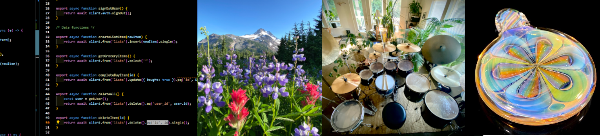
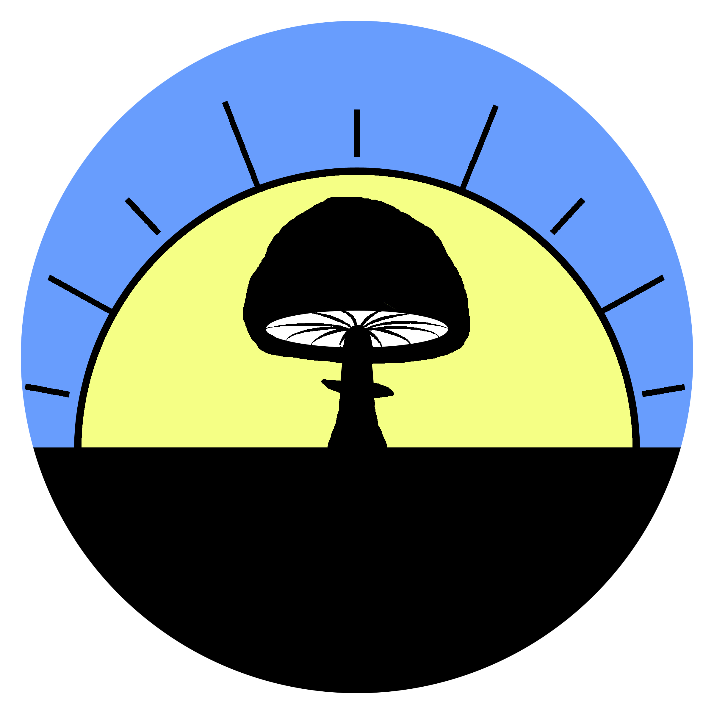

### Welcome to my github! 👋😎💻

I'm normally blowing glass and have been a self employed artist for 25 yrs but currently am enjoying a life pivot into studying full stack web development at [Alchemy Code Lab](https://www.alchemycodelab.com/). I'll be working on finishing up school in the coming months and will be looking for web dev work by April! Please reach out with any comments or questions.

Email me at kevin@kevinnail.com

### My tech stack:

### About Me

I am into and do a lot of stuff- check out my online world:  
 [kevinnail.com](https://www.kevinnail.com/)  
 [Stress Less Glass](https://www.instagram.com/stresslessglass/)  
 [ Good Morning Mushrooms](https://www.instagram.com/good_morning_mushrooms/) 
 [My Music](https://www.instagram.com/kevinnail_music/) 
 [My LinkedIn](https://www.linkedin.com/in/kevinnail/)  

