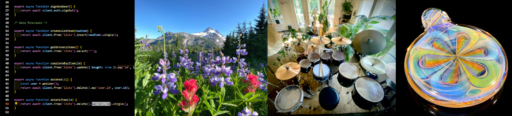
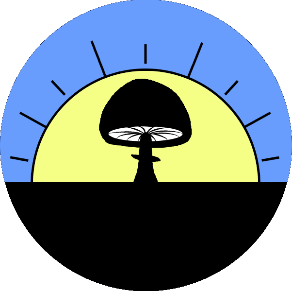

# Hello, I'm Kevin.  Welcome to my github! 👋😎💻  

Hey, I'm Kevin- normally you'll find me blowing glass in beautiful Oregon, where I've been a self-employed artist for the last 28 years. Lately though, I’ve been on a major life pivot into full-stack web development, and I  have been crushing out code for the last few years.   I have one flagship project, At The Fire- and more recently I've been delving into the world of Ollama and local LLM's building a RAG chatbot code assistant and AI agent working with an MCP server.  Check my pinned repos and try it out- it's all local, if you have 16g RAM you're good to go. 

The RAG Code Assistant & Job Search/ Career Coach Chatbot and AI Agent w/ an MCP Server
- Runs Ollama via Ubuntu/ WSL2 all local LLM calls, no internet needed
- Full chat capability, memories from relevanncy (semantic) search and recent messages combined for context
- Upload utility parsing code/ text/ markdown files w/ intelligent chunking via tree-sitter/ custom parser
- Syncs Gmail via IMAP, analyzes and determines which are web development related, drafts a summary, suggests actions, and if an appointment is detected a new event is created in Google Calendar   
- MCP server running official specs providing Google Calendar event creation tool for LLM
- All data encrypted

This started out as a proof of concept- see an LLM run locally sounded like magic.  Then came chatting.  Then context.   Then agentic capabilities so the Gmail sync and Google Calendar event creation.  Then MCP to get it to industry standard specs.  And now RAG with intellgent chunking by paragraph>sentence>word>token for text and by function and class with code.     Seeing semantic search connect to the memories that then are presented to the LLM which can then use them, and be more informed than even the big private models is my latest magic and fun with coding.   Try it out!  It's all local so there's no working website- you can check out the visual demo here,  it has no working model but spits out responses so you can see it stream and format, etc.

At The Fire is a subscription-based platform built for artists (originally for my own glass business), featuring:
- AWS Cognito for authentication
- Stripe for subscription billing
- S3 for image storage
- Encrypted business/customer data
- Inventory tracking, production goal setting, and sales analysis
- See the About & Tech Stack pages for more details, code is private but I'm happy to walk through it on request [At The Fire](https://www.atthefire.com)

What started as a tool for my own workflow has become a full-blown platform, now in beta testing. I built the core of it with two friends over 4-5 months, then continued solo for another 2 years.

I started this whole journey by learning Cloudinary image handling (since moved on to AWS S3) for my glass art website [Stress Less Glass](https://stresslessglass.kevinnail.com/main-gallery), after years of manually uploading via cPanel and FTP- and I haven’t looked back.

Follow my glass work on [Instagram](https://www.instagram.com/stresslessglass), and feel free to reach out with any questions or nerdy code stuff. Always down to talk shop.

Email me at kevin@kevinnail.com
 
 
 

<h2>My tools and tech stack so far in this journey:</h2>
(click for docs!)

 

  
<a href="https://cloudinary.com/documentation"> 
  

 
## About Me

I am into and do a lot of stuff- check out my online world:
 

| kevinnail.com                                                                                             | Stress Less Glass                                                                                                    | Good Morning Mushrooms                                                                                                      | My Music                                                                                                            | My LinkedIn                                                                                                     |
| --------------------------------------------------------------------------------------------------------- | -------------------------------------------------------------------------------------------------------------------- | --------------------------------------------------------------------------------------------------------------------------- | ------------------------------------------------------------------------------------------------------------------- | --------------------------------------------------------------------------------------------------------------- |
|  

 |  

 |  

 |  

 |  

 |

 

